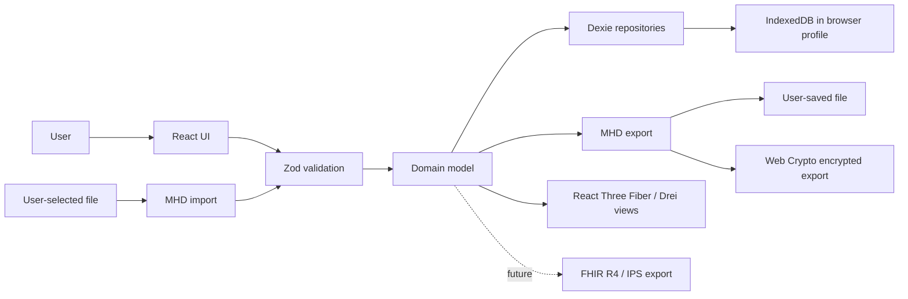

# MyHealthData Architecture

MyHealthData is a local-first, privacy-first health data web app. The v0.1 architecture assumes a React + TypeScript + Vite frontend, IndexedDB storage through Dexie, Zod validation at data boundaries, React Three Fiber and Drei for 3D body visualizations, and no backend service.

## Scope

v0.1 is a single-user, single-browser-profile application. All health data is created, imported, stored, searched, visualized, and exported on the user's device. There is no account system, server database, remote sync, analytics pipeline, or hosted API in the initial release.

The app should still be designed so future encrypted export, FHIR export, and optional user-controlled sync can be added without changing the canonical local data model.

## Goals

- Keep raw health data local by default.
- Make every persistence boundary explicit and validated.
- Preserve provenance so users can distinguish manually entered data from imported records.
- Use boring, inspectable data structures that can be exported without vendor lock-in.
- Support rich body and timeline views without making visualization state the source of truth.
- Build toward interoperability while keeping MHD JSON export as the canonical v0.1 interchange format.

## Non-goals

- No backend in v0.1.
- No remote user accounts, remote backup, telemetry, or cross-device sync.
- No clinical decision support claims.
- No HIPAA, GDPR, MDR, FDA, or CE compliance claim from the app alone.
- No direct EHR connectivity or SMART on FHIR launch flow in v0.1.
- No automatic diagnosis, treatment recommendation, or medication safety checking.

## System Context

## Application Layers

### UI Layer

React components own interaction state, route state, form drafts, filters, and visualization controls. They do not own canonical health records. UI code reads normalized records through application services or hooks and sends explicit commands to create, update, import, delete, or export data.

3D views built with React Three Fiber and Drei render body maps, anatomical anchors, or measurement overlays from domain records. 3D scene state is presentation state only. Persisted body location data should remain semantic and portable, with optional visualization anchors stored as metadata.

### Validation Layer

Zod schemas define runtime validation for:

- Form submissions.
- Import files.
- Database migration inputs and outputs.
- Export payloads.
- Any future FHIR mapping boundary.

TypeScript types should be inferred from or kept mechanically aligned with Zod schemas. The app should never trust objects read from IndexedDB, because old app versions, manual browser edits, or corrupted imports can produce invalid records.

### Domain Layer

The domain model is MHD-native. It should represent user health records in terms useful to the app: profile, observations, conditions, medications, documents, body sites, sources, tags, and import batches.

FHIR resources are not the canonical internal model in v0.1. FHIR is a future export and import mapping target.

### Persistence Layer

Dexie wraps IndexedDB and provides:

- Versioned schema migrations.
- Typed repository functions.
- Indexed queries for timelines, categories, and record relationships.
- Transactions for multi-record imports and destructive operations.

The app should avoid `localStorage` for health data. IndexedDB is the only v0.1 persistence target for records and document blobs. Small non-sensitive UI preferences can use local storage only after review.

### Export and Import Layer

MHD Export is the canonical v0.1 portable format. It is plain JSON for unencrypted export and a Web Crypto wrapper for future encrypted export. Export should be deterministic enough for testing but must not expose hidden implementation-only indexes.

Import is a validation and merge operation, not a blind database restore. It should validate the export envelope, validate each record, verify attachment hashes where present, and give the user conflict choices before overwriting existing data.

### Crypto Boundary

Web Crypto is used for user-initiated encrypted export and import. The v0.1 encrypted wrapper uses PBKDF2 for passphrase-derived keys and AES-GCM for authenticated encryption.

The app should not store encryption passphrases, derived keys, recovery secrets, or long-lived symmetric keys. Browser-resident encryption protects exported files at rest; it does not protect data while the app is open or against a compromised device.

## Data Flow

### Create or Update

1. User edits a form.
2. UI sends a command with draft values.
3. Zod validates and normalizes values.
4. Domain service applies defaults, IDs, timestamps, and relationship checks.
5. Dexie writes the record in a transaction.
6. UI re-queries or receives a state update from the repository layer.

### Read

1. UI requests records by profile, date range, type, or relationship.
2. Repository queries Dexie indexes.
3. Records are validated before becoming domain objects.
4. UI renders typed domain records.

### Import

1. User selects an MHD export file.
2. The app parses the envelope and validates the declared version.
3. If encrypted, the user supplies a passphrase and Web Crypto decrypts the payload.
4. Zod validates the decrypted payload and each record.
5. Attachment hashes are verified when attachments are present.
6. The app presents a merge plan.
7. Dexie applies accepted changes in a transaction and records import provenance.

### Export

1. User selects export scope.
2. Repository reads records and attachments.
3. Records are validated and serialized into MHD Export.
4. Optional encrypted export wraps the canonical JSON payload.
5. Browser download or File System Access API writes the file only after user action.

## Trust Boundaries

| Boundary | Trusted? | Required controls |
| --- | --- | --- |
| User input forms | No | Zod validation, explicit units, bounded strings |
| Imported files | No | Size checks, schema validation, hash checks, merge preview |
| IndexedDB records | Partially | Validate after read, migrate by version, handle corruption |
| Browser runtime | Partially | CSP, no telemetry, dependency review |
| Export files | User-controlled | Clear warnings, optional encryption, no silent uploads |
| FHIR mappings | No | Validate generated resources before claiming conformance |

## Storage Design

Use one IndexedDB database for the app. The implemented v0.1 database is `myhealthdata-v01` and is versioned with Dexie upgrades.

Implemented v0.1 stores:

- `profile`: one optional local profile.
- `events`: symptoms, notes, medication/document events, and body-linked health events.
- `measurements`: vitals and body measurements.
- `documents`: document metadata and attachment metadata.

Future store groups:

- `profiles`: local user profile records.
- `observations`: vitals, labs, symptoms, measurements, and body metrics.
- `conditions`: user-entered or imported health conditions.
- `medications`: medication statements and supplement use.
- `documents`: document metadata and attachment references.
- `documentBlobs`: document binary payloads or base64 chunks.
- `bodySites`: semantic body locations and optional visualization anchors.
- `sources`: source systems, files, user entries, or import origins.
- `importBatches`: import provenance and validation outcomes.

Deletion should remove records and related document blobs from IndexedDB when the user asks to delete them. Browser storage engines may retain recoverable remnants outside app control; this limit must be disclosed in privacy documentation.

## Error Handling

Health data errors should fail closed:

- Invalid imported records are rejected or quarantined, not coerced silently.
- Unknown schema versions stop import until a migration is available.
- Failed attachment hash verification blocks that attachment.
- Failed database migrations keep the previous database version intact where IndexedDB allows.
- Export encryption failures abort the file write.

User-facing errors should state what failed, what data was affected, and whether anything was written.

## Dependency Posture

The app should keep dependencies narrow because every dependency runs in the same browser origin as health data.

Expected dependency classes:

- React, React DOM, TypeScript, and Vite for application runtime and build.
- Dexie for IndexedDB.
- Zod for runtime validation.
- React Three Fiber and Drei for 3D body visualization.
- Web Crypto through browser APIs, not a crypto npm package, for AES-GCM and PBKDF2.

Avoid dependencies that introduce network calls, telemetry, dynamic remote code loading, or unnecessary parsers for sensitive import paths.

## Future Architecture Hooks

### Encrypted Export

The MHD export envelope is designed so encryption wraps the full canonical JSON payload. This keeps encrypted and plaintext exports semantically identical after decryption.

### FHIR and IPS Export

FHIR export should be implemented as a pure mapping layer from validated MHD records to FHIR R4 resources. IPS support should generate an IPS document bundle at export time, including a generated Composition resource, rather than storing IPS as the local source of truth.

### Optional Sync

If sync is added after v0.1, it must be opt-in and should not change the local-first invariant. The local database remains usable without a network. Sync design must introduce a separate threat model covering identity, transport, server storage, conflict resolution, deletion propagation, and breach response.

## Architecture Decisions

| Decision | Rationale | Consequence |
| --- | --- | --- |
| No backend in v0.1 | Strongest default privacy posture and simplest open-source deployment | No automatic backup or cross-device sync |
| MHD-native canonical model | Keeps app usable before complete FHIR support | Requires explicit mapping layer for interoperability |
| Dexie over raw IndexedDB | Safer migrations and query ergonomics | IndexedDB browser limits still apply |
| Zod at boundaries | Runtime safety for imports and migrations | Validation schemas become part of the data contract |
| Web Crypto for encrypted export | Browser-native authenticated encryption | Passphrase UX and recovery remain user responsibility |
| 3D as presentation | Keeps visualization independent from clinical records | Body anchors need careful mapping to semantic body sites |
