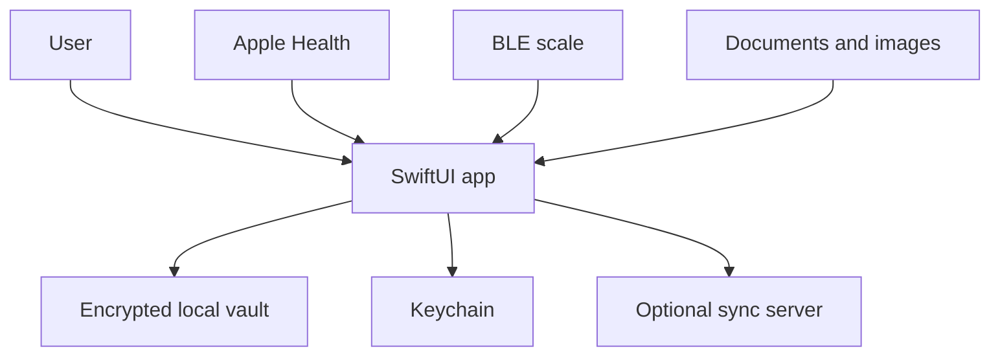

# MyHealthData Threat Model

## Executive summary
MyHealthData is a local-first SwiftUI iOS/Mac Catalyst health journal. The highest-value assets are the encrypted vault, health records, imported documents, HealthKit data and the optional self-hosted sync token. The app already encrypts the vault and attachments with AES-GCM and stores the vault key and sync token in Keychain. The main residual risks are deliberate export of plaintext JSON, user-selected document/OCR inputs, and the optional network sync boundary.

## Scope and assumptions
- In scope: `apps/ios/MyHealthDataiOS/MyHealthDataiOS` runtime code, its entitlements and release configuration.
- Runtime is local-first; sync is optional and points to a user-configured server.
- Health data, documents and body/symptom records are highly sensitive personal data.
- The sync server is outside this repository and is assumed to enforce its own authentication and access control.
- CI credentials, App Store Connect administration and the external Open Food Facts service are not fully reviewed here.

## System model
### Primary components
- SwiftUI app and module views: user entry points for health records, documents, BLE scale readings and settings.
- `HealthDataStore` and `LocalVaultStore`: local model and encrypted persistence.
- `KeychainService`: vault-key and sync-token storage.
- `HealthKitImporter`: read-only Apple Health import and incremental anchors.
- `SmartScaleBluetoothService`: Core Bluetooth discovery and manufacturer-frame decoding.
- `SelfHostedSyncClient`: optional HTTPS backup upload/download.
- `DocumentOCRService` and `LabReportParser`: user-selected file parsing and OCR.

### Data flows and trust boundaries
- User -> SwiftUI forms and share/import surfaces: health records, dates, notes and files cross into application logic; UI validation is expected and file parsers must treat content as untrusted.
- HealthKit -> `HealthKitImporter`: Apple framework query boundary; authorization is controlled by the OS, and imported samples are normalized before local persistence.
- BLE scale -> `SmartScaleBluetoothService`: nearby manufacturer frames cross a device boundary; frames are decoded locally and should never be treated as authenticated medical measurements.
- App -> local vault: encoded health data and attachments cross a storage boundary; AES-GCM and complete file protection are applied in `LocalVaultStore`.
- App -> configured sync server: encrypted backup bytes and bearer authorization cross a network boundary; HTTPS is required except HTTP localhost development.
- User-selected documents -> OCR/parser -> vault: PDFs/images and extracted text cross an untrusted parser boundary; parsing must remain bounded and failures must be recoverable.

#### Diagram

## Assets and security objectives
| Asset | Why it matters | Security objective |
|---|---|---|
| Health records and symptoms | Sensitive personal and medical history | C/I/A |
| Imported documents and OCR text | May contain diagnoses, lab results and identifiers | C/I/A |
| AES-GCM vault key | Decrypts the complete local archive | C/I |
| Self-hosted sync bearer token | Authorizes backup access | C/I |
| HealthKit samples | Detailed longitudinal health history | C/I |
| BLE readings and decoder metadata | Influences health records and user decisions | I |
| Exported JSON/backups | Portable copy of the complete journal | C/I |

## Attacker model
### Capabilities
- A person with access to an unlocked device or an exported backup.
- A malicious or compromised file supplied through document import/share.
- A malicious nearby BLE advertiser pretending to be a scale.
- A network attacker attempting to interfere with an incorrectly configured sync endpoint.

### Non-capabilities
- No assumed remote access to the local app without a user-controlled sync server or an OS compromise.
- No assumption that the BLE manufacturer frame is confidential, authenticated or medically accurate.
- No multi-tenant authorization model is present in the local vault.

## Entry points and attack surfaces
| Surface | How reached | Trust boundary | Notes | Evidence |
|---|---|---|---|---|
| HealthKit import | Settings/import flow | OS framework -> app | Read authorization and sample normalization | `Services/HealthKitImporter.swift` |
| BLE scale | Body measurements / quick capture | Nearby device -> app | Manufacturer data decoder; no device authentication | `Services/SmartScaleBluetoothService.swift` |
| Document import | Files, share extension flow, OCR | User file -> parser | Treat PDFs/images/text as untrusted | `Services/SharedDocumentImportService.swift`, `Services/DocumentOCRService.swift` |
| Lab report parser | Classified bloodwork document | Parsed text -> health records | Regex parsing and numeric normalization | `Services/LabReportParser.swift` |
| Local vault | Every persistence operation | App -> filesystem | AES-GCM plus complete file protection | `Services/LocalVaultStore.swift` |
| Sync upload/download | Optional settings flow | App -> network | Bearer token and HTTPS policy | `Services/SelfHostedSyncClient.swift` |
| Plaintext export | Backup/export action | App -> user-selected destination | Export is intentionally portable and must be clearly disclosed | `Services/MHDExportService.swift` |

## Top abuse paths
1. A user imports a crafted document -> OCR/parser consumes pathological input -> UI or memory pressure causes denial of service.
2. A nearby attacker advertises a scale-like manufacturer frame -> app accepts a false weight -> user trusts an incorrect longitudinal record.
3. A user configures an untrusted sync endpoint -> bearer token and encrypted backups are sent to that operator -> health history becomes available to the endpoint owner.
4. A user exports JSON and shares it through an unprotected destination -> the complete journal becomes readable outside the vault.
5. A local attacker obtains an unlocked device and reads application files or screenshots -> sensitive health records are exposed.
6. A malformed lab report triggers parser edge cases -> incorrect values or reference ranges are stored -> later comparisons are misleading.

## Threat model table
| Threat ID | Threat source | Prerequisites | Threat action | Impact | Impacted assets | Existing controls (evidence) | Gaps | Recommended mitigations | Detection ideas | Likelihood | Impact severity | Priority |
|---|---|---|---|---|---|---|---|---|---|---|---|---|
| T1 | Malicious file | User selects attacker-controlled file | Exercise OCR/parser with huge or malformed content | Crash, memory pressure or misleading extraction | Documents, availability, lab records | Encrypted attachment storage; parser isolation boundary in `DocumentOCRService.swift` | Bounded size/type/parse-time policy is not documented as a single gate | Enforce file size, MIME/type allowlist, page/text limits and cancellation before OCR; persist raw source separately from extracted values | Log parse duration, bytes, page count and failures without raw health text | Medium | Medium | Medium |
| T2 | Nearby BLE device | User starts scale capture | Send a scale-shaped frame with a false weight | Corrupted health trend and unsafe decisions | Weight records, integrity | Decoder records source/protocol/raw metadata in `SmartScaleBluetoothService.swift` | No pairing or cryptographic authenticity; stable measurement confirmation is heuristic | Require explicit user-triggered capture, device identity pinning, stable repeated readings and visible “unverified BLE” provenance | Count rejected frames, device changes and unstable readings | Medium | Medium | Medium |
| T3 | Sync endpoint operator | User configures server and token | Receive backups or replay bearer token | Full health-history disclosure or restore tampering | Vault backups, sync token | HTTPS policy and Keychain token storage in `SelfHostedSyncClient.swift`, `KeychainService.swift` | Server trust is user-configured; no server identity pinning or backup version policy | Document endpoint trust, add certificate pinning only if operationally supportable, rotate/revoke token, bind backup schema/version and verify checksum | Record endpoint host and status only, never token or payload | Low | High | Medium |
| T4 | Accidental export recipient | User exports journal | Open/share plaintext JSON | Complete data disclosure | Exported JSON, all health records | Local vault encryption does not extend to exported JSON | Export can be handled like an ordinary file | Add explicit sensitive-data confirmation, optional encrypted export, expiry/cleanup guidance and redacted preview | Audit export action and destination type where OS permits | Medium | High | High |
| T5 | Local device attacker | Unlocked device or backup access | Read app data, screenshots or temporary materialized attachments | Health-data disclosure | Vault previews, screenshots, records | AES-GCM, Keychain, complete file protection in `LocalVaultStore.swift` | Temporary previews need lifecycle cleanup; no app-level reauthentication gate is evident | Delete materialized preview files after use, add optional LocalAuthentication gate for sensitive modules/exports, disable sensitive previews where appropriate | Track preview creation/deletion failures | Low | High | Medium |
| T6 | Malformed report | User classifies arbitrary PDF as bloodwork | Cause parser to map text to wrong analyte/unit/range | Incorrect health interpretation | Lab records, documents | Parser is local and regex-based in `LabReportParser.swift` | Parser confidence/provenance and user confirmation need to be explicit | Store source span, parser confidence and “confirm before save”; reject ambiguous units/ranges | Report parse ambiguity and correction rate | Medium | High | High |

## Mitigation priorities
1. Add a confirmation/provenance layer for BLE and OCR-derived measurements; do not present inferred or unverified values as measured facts.
2. Make export privacy explicit and offer encrypted export before any public release.
3. Add bounded document parsing and cleanup for temporary materialized attachments.
4. Add regression tests for Keychain add/update, locked-device errors, parser ambiguity and BLE false-positive rejection.

## Focus paths for manual security review
- `apps/ios/MyHealthDataiOS/MyHealthDataiOS/Services/KeychainService.swift`
- `apps/ios/MyHealthDataiOS/MyHealthDataiOS/Services/LocalVaultStore.swift`
- `apps/ios/MyHealthDataiOS/MyHealthDataiOS/Services/SelfHostedSyncClient.swift`
- `apps/ios/MyHealthDataiOS/MyHealthDataiOS/Services/SmartScaleBluetoothService.swift`
- `apps/ios/MyHealthDataiOS/MyHealthDataiOS/Services/DocumentOCRService.swift`
- `apps/ios/MyHealthDataiOS/MyHealthDataiOS/Services/LabReportParser.swift`
- `apps/ios/MyHealthDataiOS/MyHealthDataiOS/Services/MHDExportService.swift`
- `apps/ios/MyHealthDataiOS/MyHealthDataiOS/Resources/MyHealthDataiOS.entitlements`

## Quality check
- HealthKit, BLE, file/OCR, local vault, sync and export entry points are covered.
- Each trust boundary appears in at least one abuse path or threat row.
- Runtime behavior is separated from external sync-server assumptions.
- The main unresolved assumption is whether the sync server is operated only by the user or by a third party.
